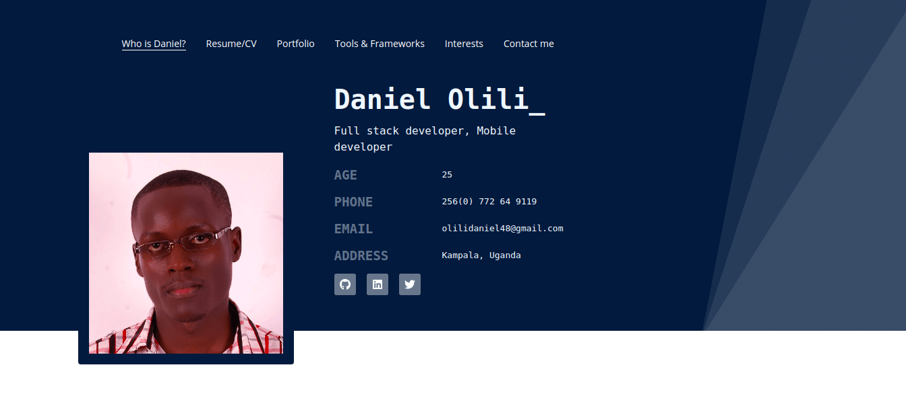

# OLILI DANIEL - My portfolio site

&nbsp;&nbsp;&nbsp;

> This is my personal profile built in ReactJS.

[VIEW DEPLOYMENT](http://olili.netlify.com)

---

### Table of Contents

- [Description](#description)
- [What to expect](#how-to-use)
- [References](#references)
- [License](#license)
- [Author Info](#author-info)

---

## Description

This is a personal developer profile project written entirely in [ReactJs](https://reactjs.org) by me. It is meant to provide a brief about my history and to illustrate my capability in react front-end development

#### Technologies

- ReactJs
- Npm (for package management)

## Built With

* [ReactJs](https://reactjs.org) - The web framework used
* [NPM](https://maven.apache.org/) - Dependency Management

[Back To The Top](#My-portfolio-site)

---

## What to expect

#### Who is Daniel

Simple info about me (includes bio). describes the journey i have so far taken as a developer and what i look to in the near future.

#### Resume

Brief about my professional and accademic life. plus descriptions where needed.

#### Tools & frameworks

The tool, frameworks as well as programming languages that I am familiar with (interface mostly).

#### Contact me
provides links to my social profiles and a small contact form where one can reachout directly through the site.

---

## References

- [AlgoEpert](https://algoexpert.io) - Inspiration for the color scheme used.
- [React bootstrap](http://react-bootstrap.netlify.com) - Bootstrap used in site

[Back To The Top](#My-portfolio-site)

---

## License

MIT License

Copyright (c) [2019] [Daniel Olili]

[Back To The Top](#My-portfolio-site)

---

## Author Info

- Twitter - [@olilidaniel](https://twitter.com/olilidaniel)
- Website - [Daniel Olili](https://olili.netlify.com)
- LinkedIn - [daniel olili](https://www.linkedin.com/in/daniel-olili-93029b111/)

[Back To The Top](#My-portfolio-site)